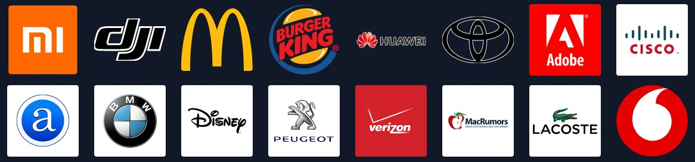
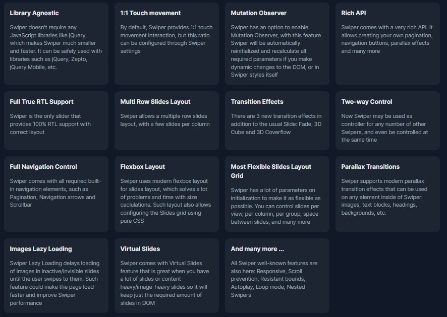
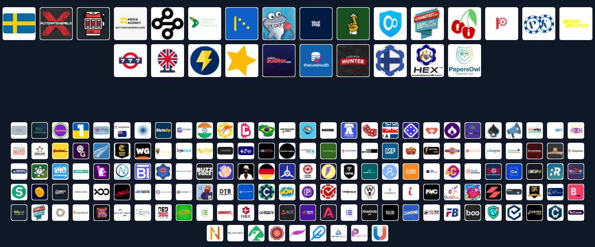

# About-Animate-in-React

## Swiper

### Swiper is the most modern free mobile touch slider with hardware accelerated transitions and amazing native behavior. It is intended to be used in mobile websites, mobile web apps, and mobile native/hybrid apps.

### It is a modern touch slider which is focused only on modern apps/platforms to bring the best experience and simplicity.

### Swiper, along with other great components, is a part of Framework7 - a fully-featured framework for building iOS & Android apps. Swiper is also a default slider component in the Ionic Framework.

(russian language)

### Swiper — это самый современный бесплатный сенсорный слайдер для мобильных устройств с аппаратным ускорением переходов и потрясающим собственным поведением. Он предназначен для использования на мобильных веб-сайтах, мобильных веб-приложениях и мобильных нативных/гибридных приложениях.

### Это современный сенсорный слайдер, который ориентирован только на современные приложения/платформы, чтобы обеспечить лучший опыт и простоту.

### Swiper, наряду с другими замечательными компонентами, является частью Framework7 — полнофункционального фреймворка для создания приложений для iOS и Android. Swiper также является компонентом слайдера по умолчанию в Ionic Framework.

## Available For
 

## Used By Millions

## Easy As

## Powered With Top Notch Features

## And It Is Free
### Swiper is completely free and open-source (MIT Licensed)

## Sponsors

